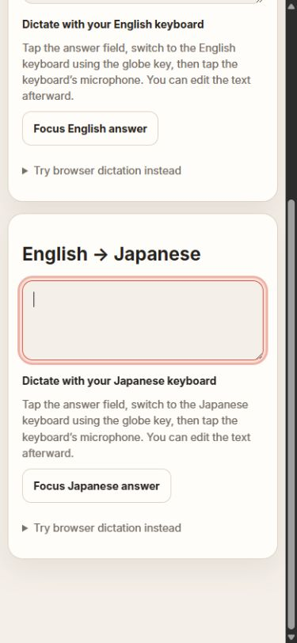
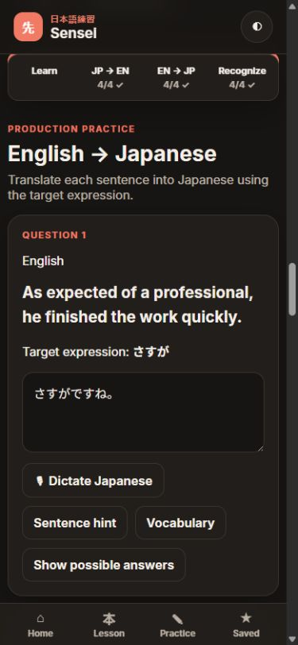
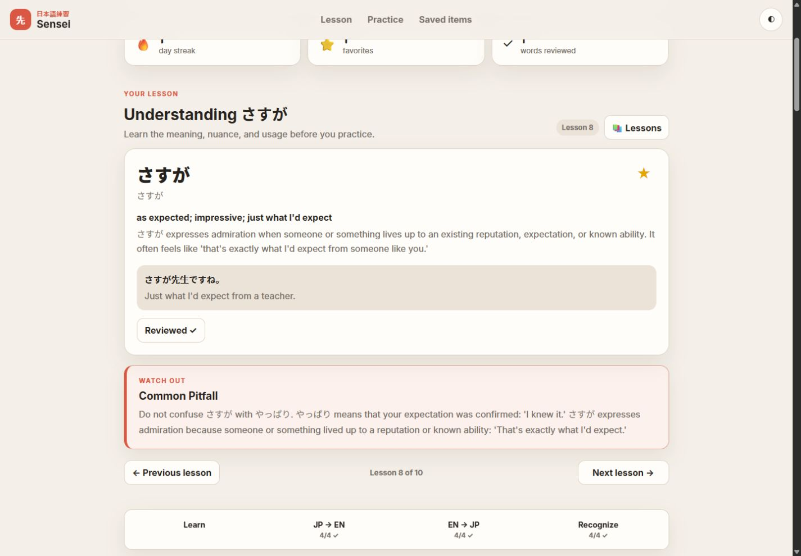
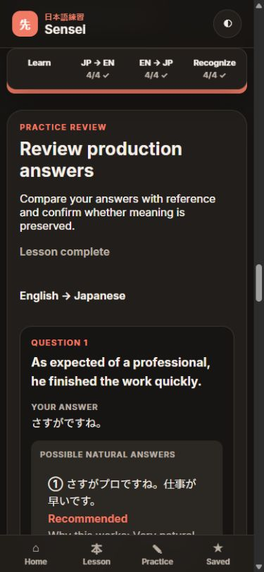
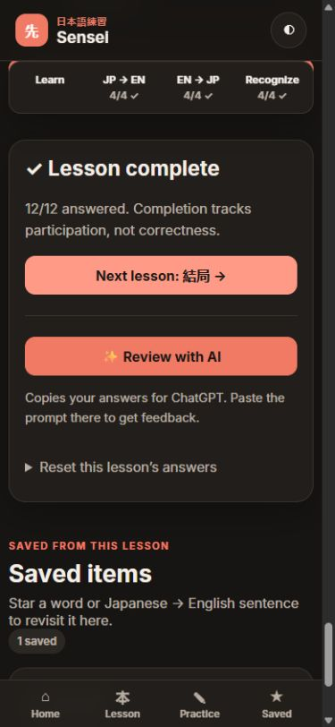

# Sensei usability QA — 2026-09-12

## Dictation follow-up

Keyboard-first iPhone/iPad guidance: PASS for device-detection tests (including desktop-mode iPad and non-Apple desktops), English/Japanese wording, unchanged desktop controls, field-focus buttons, optional disclosure expansion/collapse, and unsupported-recognition fallback. The fixture at `tests/dictation-preview.html` uses the real renderer with Apple-mobile presentation selected explicitly; it does not emulate an iPhone microphone. At 390px viewport width, content width is 375px with no horizontal overflow. Browser console errors/warnings were empty. Both automated suites pass. Physical keyboard language switching and actual iPhone dictation remain device-level checks.

Repeat-session repair: automated tests now simulate asynchronous browser shutdown, speech-end and final-result cleanup, three consecutive Japanese dictations, duplicate/late events, and missing-end recovery. All pass, as does the ten-lesson regression suite. This addresses confirmed lifecycle gaps in the app; the reported physical-iPhone symptom has not been reproduced on a connected iPhone and requires a device retest.

| Check | Result | Evidence |
| --- | --- | --- |
| Language routing and transcript handling | PASS | `node tests/dictation.mjs`: English en-US and Japanese ja-JP, append without overwriting, no interim-text persistence, duplicate final-event protection. |
| Stop and cancellation | PASS | Simulated session replacement, manual editing, and explicit cancellation abort recognition and ignore late results. |
| Errors and unsupported browser | PASS | Simulated permission denial restores the control; absent recognition API gives keyboard-dictation guidance. |
| Browser rendering | PASS | Local Lesson 8 renders four English and four Japanese microphone buttons; no console errors/warnings observed. |
| Phone layout | PASS | 390px viewport, 375px content width; Japanese mic and hint controls fit without horizontal overflow. |
| Existing lesson behavior | PASS | Existing all-ten-lesson regression suite still passes. No schema or saved-answer migration. |
| Actual speech transcription | NOT TESTED | No microphone recording was started. Recognition events were simulated; English/Japanese speech accuracy and physical phone behavior still need user testing. |

Test environment: local HTTP server, Codex browser, 1440 × 1000 desktop and 390 × 844 phone viewports. Test responses were entered only on localhost; live learner responses were not modified.

| Feature | Result | What was tested |
| --- | --- | --- |
| Lesson data | PASS | Loaded all ten JSON files through the lesson loader; checked manifest IDs, counts, unique item IDs, and reference feedback generation. |
| Lesson compatibility | PASS | Browser navigation through the library; separately verified Lesson 1 hides optional phases, Lesson 5 displays production references, Lesson 8 has recognition, and Lesson 10 has no unusable Next control. |
| JP → EN, EN → JP, recognition | PASS | Entered four answers in each translation direction and selected four recognition choices in Lesson 8. Each Check Answers button showed four feedback cards under its own section. |
| Independent reviews | PASS | Opened all three reviews simultaneously. Editing a production answer cleared only production feedback; the other two remained open. |
| Completion and missing answers | PASS | With 11/12 answered, summary showed Recognize: 1 left. Clicking it focused the unanswered fourth recognition question. Answering it showed 12/12 and Next lesson: 結局. Correctness and reviewed-word state are not required. |
| Next lesson and persistence | PASS | Used the completion button to open Lesson 9, then Previous lesson to return to Lesson 8. Answers remained; Lesson 9 did not inherit them. Reload retained responses and completion. |
| Phase navigation | PASS | Phone EN → JP shortcut landed with the section heading below the sticky controls. Fixed popstate handling that previously reloaded the lesson on hash jumps. |
| Hints and reference answers | PASS | Expanded Sentence hint, Vocabulary, and Show possible answers; collapsed Vocabulary again. Confirmed multiple references and notes in production feedback. Automated checks covered legacy sampleAnswer fallback. |
| Favorites and reviewed words | PASS | Starred さすが and marked it reviewed. Saved items reflected the favorite. Both survived reload, lesson switching, and confirmed answer reset. |
| Reset safeguards | PASS | Inline reset confirmation opened. Keep my answers preserved the entered test response. Yes, clear answers returned progress to zero while retaining favorites and reviewed words. Replaced a native browser confirmation after it proved awkward in the embedded browser. |
| AI handoff | PASS | Review with AI copied the learner prompt; clipboard contained the exact Japanese test answer. The panel displayed paste instructions, a manual prompt disclosure, and a direct ChatGPT link. No AI API call or prompt submission was made. |
| Saving failures | PASS | Automated storage mock rejected writes: status became error and the answer stayed in memory. Successful retry changed status to saved. The UI maps this status to a persistent warning. |
| Desktop and mobile | PASS | Inspected light desktop and dark phone screenshots; 980px single-word card filled the desktop content area. Phone content width was 375px within a 390px viewport: no horizontal overflow. Phase navigation did not cover the destination heading. |
| Theme | PASS | Switched light/dark through the UI and reloaded; selected theme persisted. Improved primary-button text contrast. |
| JavaScript and regression checks | PASS | Node syntax checks, git whitespace check, and tests/usability.mjs passed. Browser error/warning logs were empty during the checked interactions. |

## Test limits

- Phone checks used a resized browser, not a physical iPhone/Android keyboard or screen reader.
- Browser clipboard denial was not manually forced. The manual-copy fallback remains available and exceptions from the legacy copy method are caught.
- This is a focused usability/content repair, not a full linguistic audit of every lesson.
- Answers remain saved in this browser on this device; cross-device sync is not part of this update.

## Screenshots

### Desktop lesson

### Phone production review

### Phone completion

